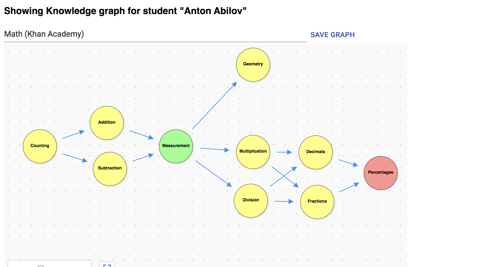

# Knowledge Graphs
This project contains a prototype for visualizing a learner's progress using a knowledge graph _[(read more about the project's motivation here)](https://docs.google.com/document/d/1qBvT04XL3_nN5ziYyZpgOEUsM8FMjhYHFu0M2pr5-4U/edit#heading=h.orgg9exffmxc)_.

A knowledge graph is a graph structure that can represent any subject domain:
- each circle represents a topic within a subject
- each arrow represents prerequisites between the topics

_This is still an early prototype. Follow this repository for updates_

By adding attributes to the topics about a student’s performance and coloring the circles accordingly, we get a clear visual representation of a learner's progress.
We can look at the dependencies between concepts to potentially find gaps in prerequisuite knowledge that is required to perform well in more advanced concepts.

The prototype allows anyone to create a new graph, since we assume that knowledge experts would like to create various representations and experiment to find the right level of abstraction. A knowledge graph could be generic and apply for all learners of a subject or it could be tightly coupled to a teacher's curriculum. Similary, a graph could be taoilored to a student.

## Technologies
- Stack: TypeScript, Firestore, React, Styled Components
- Libraries: [React digraph](https://github.com/uber/react-digraph), [Material UI](https://material-ui.com/)

## Intall and run
1. Install dependencies: `yarn install`
2. Run the dev server `yarn dev` (or `yarn watch` for hot-reloading)
3. Update the firebase config in `src/firebaseConfig.ts` to persist graphs to a [firestore instance](https://cloud.google.com/firestore)
4. Access http://localhost:9000

## Interacting with the graph
- Shift-click the canvas to create a new node
- Click a node or edge to edit it
